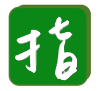
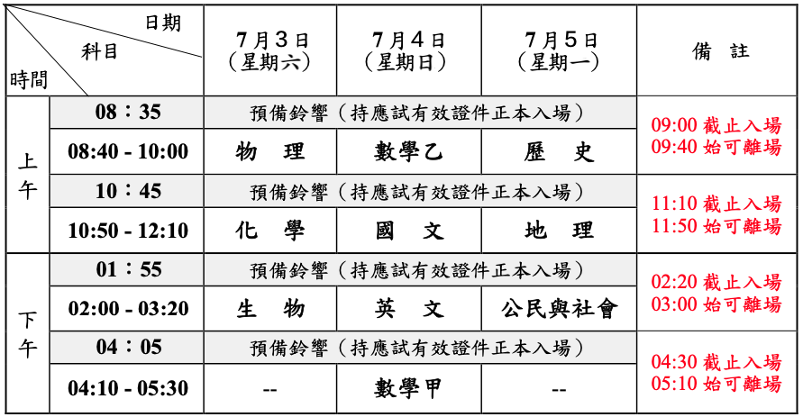
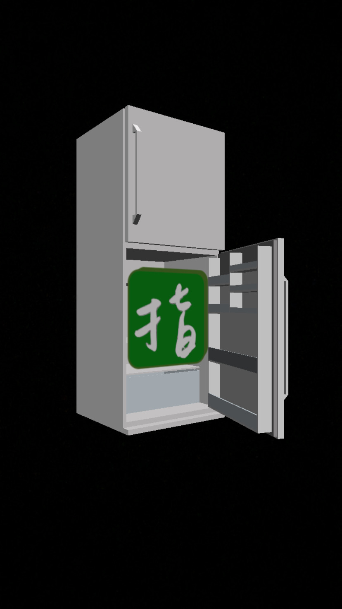

# ASTfilter
### Origin
In Taiwan, We have two main ways to enter a college, one is GSAT, which is held in late January, and the other is AST, held in early July. About half of the students could get into college via GSAT, and the other students have no choice but to keep studying until July to attend AST. We call these students **AST Fighters**.  
After studying in college for half a year, the coming GSAT recalled my memories being a AST fighter. I remembered the hard work I've done those days, and the memories are combined with laugh and tears.  
An idea came into my mind: Why not build a AST Fighter filter to accompany with them? For those who are gonna study for another half year, a interesting filter with countdown timer and exam schedule could be useful, and thus I started my work to build a instagram filter.

### About
The filter has 5 effects: 
1. 

.png)
.png)

