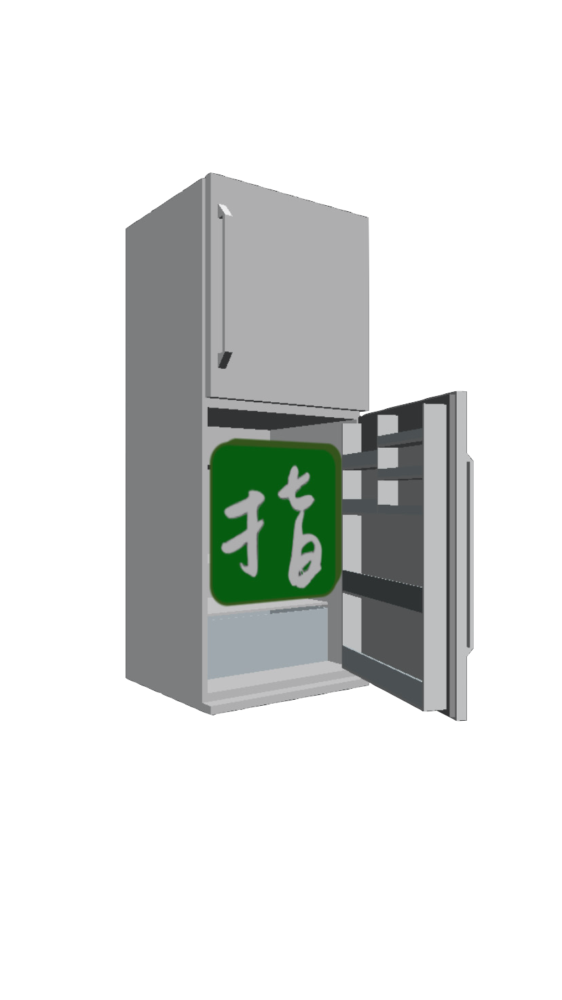

# ASTfilter
### Origin
In Taiwan, We have two main ways to enter a college, one is GSAT, which is held in late January, and the other is AST, held in early July. About half of the students could get into college via GSAT, and the other students have no choice but to keep studying until July to attend AST. We call these students **AST Fighters**.  
After studying in college for half a year, the coming GSAT recalled my memories being a AST fighter. I remembered the hard work I've done those days, and the memories are combined with laugh and tears.  
An idea came into my mind: Why not build a AST Fighter filter to accompany with them? For those who are gonna study for another half year, a interesting filter with countdown timer and exam schedule could be useful, and thus I started my work to build a instagram filter.

### How it works?
I made this filter by Spark AR Studio, and I wrote some JS to fulfill the countdown work. I also did some animation works to let the fridge close and open repeatedly. When one using the filter, it would detect one's face, and put effects on their face and head.  
  
### About
The filter has 5 effects, and I'll show all of them above:

---  

> The Chinese word "指考" stands for AST, and we often use this emoji(🈯️) to represent AST.  

---

> Lots of Taiwanese students would resit if they weren't satisfy about their AST score, so this effect aims to pray for AST fighters that all of them could get into their dream college by AST rather than re-take GSAT.  
  
---

> The Chinese word of **AST Fighter**.  
  
---

> The exam schedule of 2021 AST. A countdown timer for 2021 AST is included.  
  
---

> The topic of Chinese essay writing subject in 2021 GSAT is "If I had a Refrigerator...", and fridge became a famous joke at that time.
  
### Future & ...
Since there won't have AST in the future due to education reform, I might not update this filter. However, I **do** plan to create other filters in the future!!  
If you have any idea or advice, feel free to [contact me](mailto:b09705045@ntu.im):)
